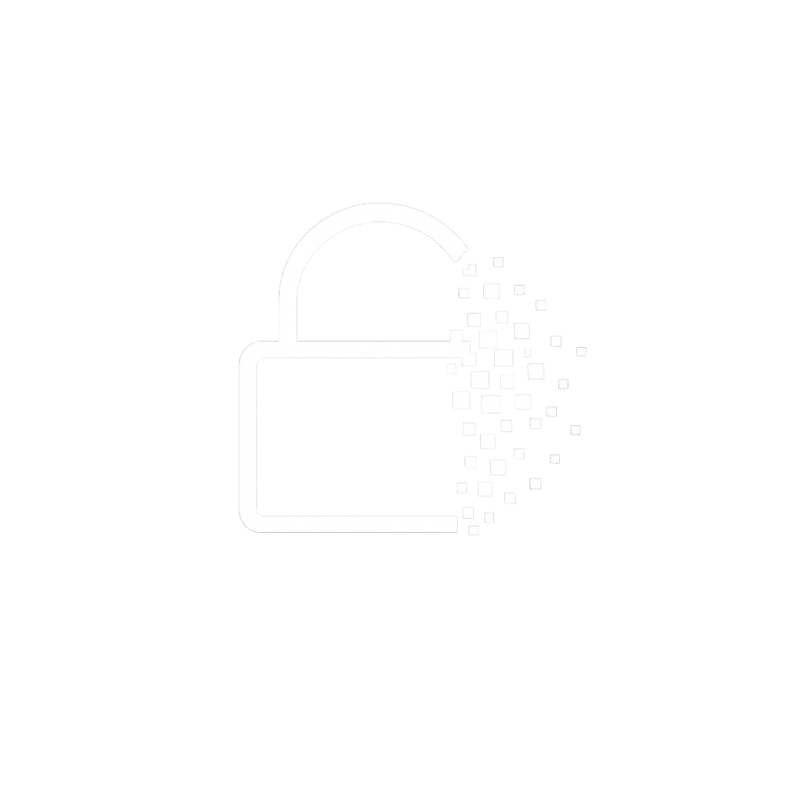

<p align="center">
  
</p>

<h1 align="center">ephemeral-secret-share</h1>

<p align="center">
  Share secrets via one-time links — client-side encrypted, self-hosted, instant deletion.
</p>

<p align="center">
  
  
  
  
  
</p>

---

## How it works

- Run `ess "my-secret"` — encrypts locally with AES-256-GCM, opens a public tunnel via [Cloudflare Tunnel](https://developers.cloudflare.com/cloudflare-one/connections/connect-networks/), and gives you a shareable one-time link.
- The encryption key lives only in the URL fragment (`#...`), which browsers never send to the server. The server only stores the ciphertext.
- The recipient opens the link on any device, clicks "View secret", and the browser decrypts client-side using the Web Crypto API.
- After one view, the ciphertext is permanently deleted from server memory and the link is dead.

## Installation

Requires `cloudflared` for public sharing (auto-installed via Homebrew on first run if not present):

```
brew install cloudflared
```

With [pipx](https://pipx.pypa.io/) (recommended):

```
pipx install git+https://github.com/august-andersen/ephemeral-secret-share.git
```

With pip:

```
pip install git+https://github.com/august-andersen/ephemeral-secret-share.git
```

From source:

```
git clone https://github.com/august-andersen/ephemeral-secret-share.git
cd ephemeral-secret-share
pipx install .
```

## Usage

```bash
# Share a secret (public link via Cloudflare Tunnel)
ess "sk-ant-abc123-my-api-key"

# Localhost only (no tunnel)
ess "my-secret" --local

# With expiry
ess "my-secret" --expires 1h
ess "my-secret" --expires 30m

# Custom port
ess "my-secret" --port 9090

# Pipe support
echo "my-secret" | ess

# Interactive prompt (hidden input)
ess
```

## Security

- **AES-256-GCM** authenticated encryption.
- Encryption and decryption happen **client-side only** (Python CLI and browser).
- The server stores and serves only ciphertext. It never sees the plaintext or the key.
- The encryption key is in the URL fragment (`#...`), which is [never sent to the server](https://www.rfc-editor.org/rfc/rfc3986#section-3.5) by browsers.
- Secrets are stored in memory only, lost when the server stops.
- Each secret is deleted immediately after being retrieved once or after expiry.

## License

MIT
